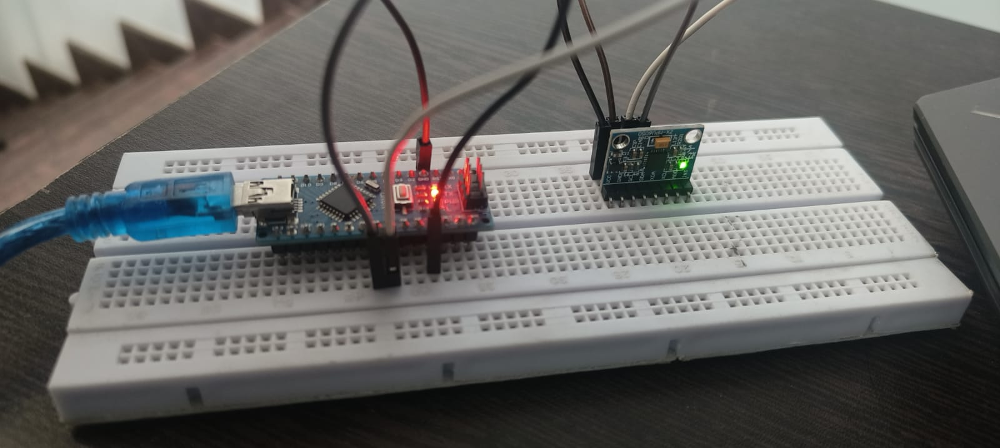

# ⚠️ Gyroscope Tilt Warning System
 
A simple Arduino-based project that detects excessive tilt using an MPU6050 gyroscope/accelerometer and triggers a **buzzer** and **serial warning** when the device tilts beyond a safe angle.
 
Ideal for use in small robots, safety systems, or orientation-sensitive applications.
 
---
 
## 🧠 Features
 
- Reads tilt angles using the MPU6050 sensor
- Sounds a buzzer if the tilt exceeds ±30°
- Prints a **"⚠️ WARNING: TILT EXCEEDED"** message on the Serial Monitor
- Lightweight, beginner-friendly code
 
---
 
## 🛠️ Hardware Required
 
| Component         | Quantity |
|------------------|----------|
| Arduino UNO/Nano | 1        |
| MPU6050 Module   | 1        |
| Buzzer           | 1        |
| Jumper Wires     | as needed|
| Breadboard       | Optional |
 
---
 
## 🔌 Connections
 
### MPU6050 to Arduino:
| MPU6050 Pin | Arduino Pin |
|-------------|-------------|
| VCC         | 5V          |
| GND         | GND         |
| SDA         | A4          |
| SCL         | A5          |
 
### Buzzer:
- Positive → D8  
- Negative → GND
 
---

## 🎬 Demo Video

[Click here to watch the demo](gyro/gv.mp4)


## Circuit



 
## 💻 Code Preview
 
```cpp
if (abs(angleX) > 50 || abs(angleY) > 30) {
  digitalWrite(buzzerPin, HIGH);
  Serial.println("⚠️  WARNING: TILT EXCEEDED");
}


